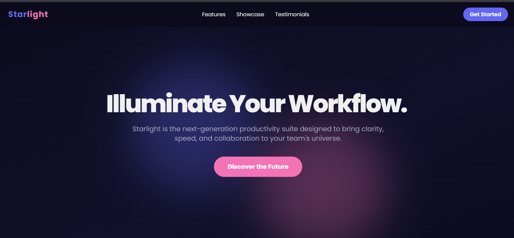
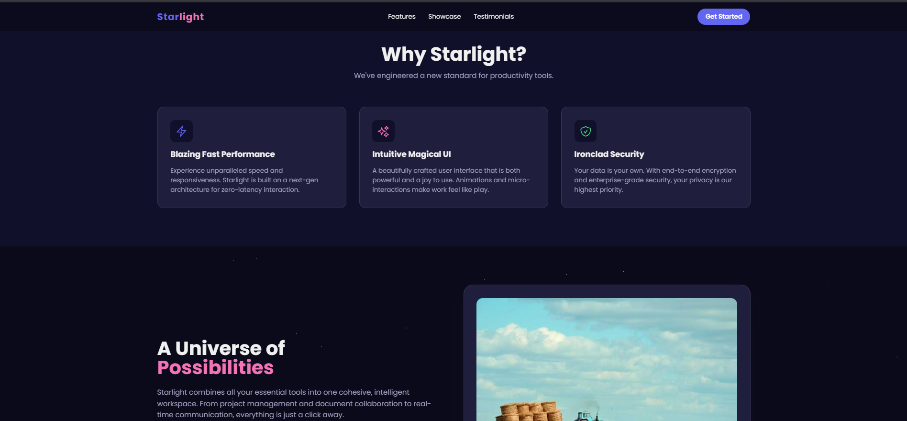

  <h1>Starlight - Animated Landing Page</h1>

## 🚀 Overview

Starlight is a visually stunning, animated landing page for a fictional productivity application. This project showcases modern web development techniques, with a focus on creating a fluid and engaging user experience through animations and a sleek, dark-themed design inspired by the cosmos.

## ✨ Key Features

- **Engaging Animations:** Built with Framer Motion for smooth, scroll-based and interactive animations that bring the page to life.
- **Responsive Design:** Fully responsive layout that looks great on all devices, from mobile phones to desktops.
- **Modern UI/UX:** A beautiful dark-mode interface with a cohesive "space" theme, custom fonts, and a vibrant color palette.
- **Component-Based Architecture:** Developed with React for a modular, scalable, and maintainable codebase.
- **Styled with Tailwind CSS:** Utilizes Tailwind CSS for rapid and utility-first styling.

## 🔗 Live Demo

Check out the live version of the project hosted on Vercel:

[**Visit Live Demo**](https://starlight-animated-landing-page.vercel.app/)

## 📸 Screenshots

Here's a glimpse of Starlight in action.

**Hero Section**

**Features Section**

## 🛠️ Tech Stack

- **Frontend:** React, TypeScript
- **Styling:** Tailwind CSS
- **Animations:** Framer Motion
- **Build Tool:** Vite
